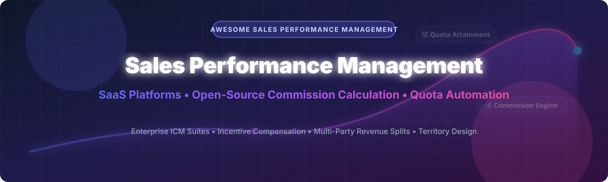

# 🚀 Awesome Sales Performance Management (SPM) Software & Open-Source Ecosystem

  
  
  
  

> 💡 A curated ecosystem list of top **Sales Performance Management (SPM)** platforms, **Incentive Compensation Management (ICM)** software, sales quota automation tools, commission tracking platforms, and **open-source sales performance & commission calculation engines**.

🗓 **Last updated: October 2026**

---

## 🔍 Overview & SEO Guide to Sales Performance Management (SPM)

**Sales Performance Management (SPM)** is an enterprise operational domain focused on optimizing sales representative productivity, incentive compensation accuracy, quota allocation, sales territory design, and sales forecasting. SPM software connects CRM deal data with finance payroll systems to automate complex multi-tier sales commission structures, clawbacks, manager overrides, and performance analytics.

Whether you are looking for enterprise commercial ICM suites or self-hosted open-source commission calculation packages, this directory covers the complete SPM technology landscape.

---

## 📊 Market Overview & Industry Landscape

- 📈 **Estimated Market Size**: The global Sales Performance Management (SPM) software market is estimated at **~$2.5 Billion to $3.1 Billion** (2025–2026) and is projected to grow at a CAGR of 13.5% reaching over $5.5 Billion by 2030.
- 🏢 **Market Structure**: The sector is **moderately fragmented to concentrated at the enterprise level**, with category giants (Salesforce, SAP, Anaplan, Xactly, Varicent) holding the majority of enterprise market share, while agile mid-market platforms (CaptivateIQ, Spiff/Salesforce, QuotaPath, Performio) compete aggressively on ease-of-use and flexibility.

---

## 📑 Table of Contents

- 💼 [SaaS & Commercial SPM Platforms](#-saas--commercial-spm-platforms)
- 🔓 [Open-Source Sales Performance & Commission Engines](#-open-source-sales-performance--commission-engines)
- 🏗 [Key Open-Source Frameworks & Integration Architectures](#-key-open-source-frameworks--integration-architectures)
- 🤝 [How to Contribute](#-how-to-contribute)
- 💖 [Support & Community](#-support--community)
- 📈 [Star History](#-star-history)
- ⚠️ [Disclaimer](#-disclaimer)

---

## 💼 SaaS & Commercial SPM Platforms

The table below lists top commercial Sales Performance Management (SPM) and Incentive Compensation Management (ICM) platforms, **sorted by company valuation / annual revenue (descending)**.

| Rank | Platform | Description & Target Market | Specific Starting Pricing | Free Tier / Free Trial Limit | Valuation / Annual Revenue |
| :--- | :--- | :--- | :--- | :--- | :--- |
| 1 | **[Salesforce Sales Performance Management](https://www.salesforce.com/)** | Native SPM suite for Salesforce Sales Cloud handling quota planning, territory allocation, and commission tracking. Best for Salesforce enterprise customers. | **$75/user/month** (Sales Cloud Enterprise base + SPM add-on pricing) | **30-day free trial** (Sales Cloud trial with full CRM & SPM feature access) | **~$300 Billion Market Cap** (~$34.8B annual revenue) |
| 2 | **[SAP SuccessFactors Incentive Management](https://www.sap.com/)** | Enterprise-grade incentive compensation management and enterprise planning platform. Best for SAP-centric global enterprises. | **$120/user/month** (Enterprise custom quote baseline) | **30-day trial** via SAP PartnerEdge / SAP SuccessFactors demo environment | **~$240 Billion Market Cap** (~$33B annual revenue) |
| 3 | **[Anaplan SPM](https://www.anaplan.com/)** | Connected enterprise planning platform integrating territory design, quota allocation, and compensation modeling. Best for large enterprises. | **$50,000/year base platform subscription** (~$80–$120/user/month) | **No free tier**; 14-day guided sandbox demo upon request | **$10.4 Billion Valuation** (Acquired by Thoma Bravo; ~$592M revenue) |
| 4 | **[CaptivateIQ](https://www.captivateiq.com/)** | Modern, flexible commission management platform with real-time modeling and CRM integrations. Best for mid-market and fast-growing teams. | **$40/user/month** (Minimum contract starting at ~$8,000/year) | **14-day free trial** (Full sandbox access for commission plan testing) | **$1.25 Billion Valuation** (Unicorn Series C; ~$45M ARR) |
| 5 | **[Xactly Incent](https://www.xactlycorp.com/)** | Cloud enterprise standard for incentive compensation management and enterprise sales analytics. Best for enterprises with complex compensation plans. | **$50/user/month** (Express tier; Enterprise custom tier from $100+/user/month) | **14-day guided trial** via Xactly Express demo sandbox | **$564 Million Valuation** (Acquired by Vista Equity; ~$288M ARR) |
| 6 | **[Spiff (Salesforce)](https://www.spiff.com/)** | Real-time sales commission automation software with custom plan builder and rep visibility. Best for fast-growing sales teams. | **$60/user/month** (Growth plan; custom enterprise quotes available) | **14-day free trial** (Full interactive commission automation demo) | **$419 Million Valuation** (Acquired by Salesforce in 2024) |
| 7 | **[Varicent](https://www.varicent.com/)** | Comprehensive sales performance management and enterprise sales incentive platform. Best for global enterprise sales operations. | **$75/user/month** (Standard deployment tier base estimate) | **30-day partner sandbox trial** upon enterprise sales request | **~$400 Million Est. Valuation** (Backed by Warburg Pincus; ~$150M+ ARR) |
| 8 | **[Performio](https://www.performio.com/)** | Enterprise-grade sales commission software built for automated calculations and auditability. Best for mid-market and enterprise teams (30+ reps). | **$60/user/month** (Mid-market tier baseline + custom implementation fee) | **14-day custom demo trial** (Configured sandbox with sample company data) | **~$150 Million Est. Valuation** ($75M JMI Growth round; ~$30M ARR) |
| 9 | **[QuotaPath](https://www.quotapath.com/)** | Transparent commission calculation and quota attainment software with CRM sync. Best for SMB and mid-market sales teams. | **$35/user/month** (Growth plan; Premium plan at $50/user/month) | **30-day free trial** (Unlimited features for up to 10 users during trial) | **~$120 Million Est. Valuation** ($67M total raised; Series B led by Tribe) |
| 10 | **[Iconixx](https://www.iconixx.com/)** | All-in-one compensation management software for sales commissions, bonus plans, and merit pay. Best for complex mid-market compensation plans. | **$45/user/month** (Standard edition starting price) | **14-day demo environment trial** upon sales request | **~$25 Million Est. Valuation** (Privately held sales operations vendor) |

---

## 🔓 Open-Source Sales Performance & Commission Engines

Open-source tools provide developer-friendly building blocks for self-hosted commission calculation, payment splits, performance ledgers, and developer incentive tracking. 

The table below features notable open-source repositories, **sorted by GitHub Star Count (descending)**. Each star badge links directly to the repository's stargazers page.

| Rank | Project Name | Stars | Description & Features | Primary Tech Stack | Best For |
| :--- | :--- | :--- | :--- | :--- | :--- |
| 1 | **[Affiliate Management System](https://github.com/prathammahajan13/affiliate-management-system)** |  | Multi-tier affiliate commission program with Bronze/Silver/Gold tiers, real-time fraud detection, volume bonuses, and multi-gateway payout integration (Stripe, PayPal, Razorpay). | Node.js, Express, MongoDB | E-commerce, SaaS & Digital Marketplaces |
| 2 | **[Laravel Sales Commission](https://github.com/ayangzy/laravel-sales-commission)** |  | Enterprise-grade sales commission engine for Laravel applications. Features automated tier progression (Bronze → Platinum), clawback grace periods, team split rules (closer, manager override), and event-driven payout processing. | PHP 8.2+, Laravel 10/11 | Laravel SaaS & Enterprise Web Apps |
| 3 | **[SampleFlow](https://github.com/Eclipseic1848/SampleFlow)** |  | Auditable sales performance & target management platform featuring immutable append-only performance ledgers, layered target approval workflows, role-based access control, and controlled Excel imports. | React 19, Fastify 5, PostgreSQL 16 | Auditable Enterprise Target & SPM Systems |
| 4 | **[EngOS](https://github.com/dust-tt/engos)** |  | Engineering compensation modeling engine supporting base salary, cash vs. equity bonus split decisions, 4-year linear vesting schedules, multi-country FX calculations, and long-term equity projections. | Node.js, TypeScript CLI | Engineering Compensation & Equity Planning |
| 5 | **[@classytic/revenue](https://www.npmjs.com/package/@classytic/revenue)** |  | Payment lifecycle & multi-party revenue split engine for platforms. Handles escrow holds, platform fee deductions, multi-level affiliate splits, and automated payment gateway routing. | JavaScript / TypeScript | Marketplaces & Multi-Party Revenue Splits |
| 6 | **[Meow Pipeline Manager](https://github.com/nash-md/meow)** |  | Lightweight open-source sales pipeline & quota forecast tracker. Supports custom funnel stages, automatic weighted deal forecasting, drag-and-drop schema editing, and team performance tracking. | TypeScript, React, Express, MongoDB | SMB Sales Pipeline & Quota Tracking |

---

## 🏗 Key Open-Source Frameworks & Integration Architectures

- ⚙️ **For SaaS & Web Applications**: Integrate **Laravel Sales Commission** for server-side commission calculation with multi-tier bonus structures, manager overrides, and automated clawbacks.
- 🛒 **For E-Commerce & Marketplaces**: Deploy **Affiliate Management System** for tier-based commission tracking and fraud prevention, or use **@classytic/revenue** for complex multi-party escrow and revenue splits.
- 🛡️ **For Enterprise Audit Compliance**: Use **SampleFlow** for immutable performance event logs, target approvals, and secure data ingestion.
- 📊 **For Compensation & Equity Planning**: Utilize **EngOS** to model cash vs. equity bonus distributions and multi-year vesting projections.

---

## 🤝 How to Contribute

1. 🍴 Fork this repository.
2. 📝 Add or update entries in `README.md` using the Markdown table format.
3. 💲 Ensure all SaaS submissions include specific starting pricing, exact free trial/tier details, and company valuation/revenue metrics.
4. 💻 Open-source submissions must include a valid GitHub repository link and tech stack specifications.
5. 🚀 Submit a Pull Request with a clear description of the added project.

---

## 💖 Support & Community

Thank you for visiting and supporting this curated Sales Performance Management ecosystem repository! 🙏 If you find this list helpful for your sales operations, engineering, or finance stack research, please consider:

- ⭐ **Starring** this repository on GitHub to help others discover it.
- 🔀 **Forking** the repo to contribute new SPM products, commission calculators, or tools.
- 📢 **Sharing** this repository with sales ops leaders, engineers, and financial analysts.

☕ **Buy Me a Coffee**: If you would like to sponsor and support ongoing open-source maintenance, check out the [GitHub Sponsor Dashboard](https://github.com/sponsors/ishandutta2007).

---

## 📈 Star History

---

## ⚠️ Disclaimer

- ℹ️ This list is **community-curated** for research and evaluation purposes.
- 🔒 Sales Performance Management systems handle confidential compensation, payroll, and personal data (PII). Ensure proper encryption, role-based access control, and GDPR/CCPA compliance when deploying self-hosted solutions.
- 🎯 Test commission calculation engines thoroughly against edge cases (clawbacks, split payouts, tier resets) before deploying to production.
